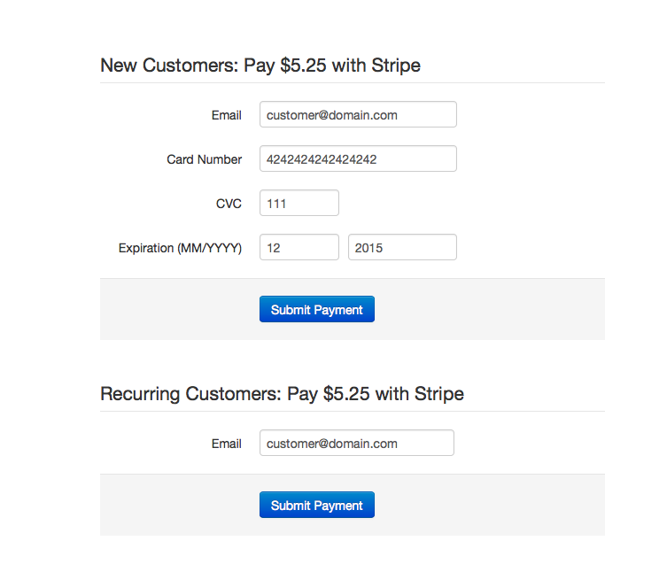

# stripe-flask

A simple Python (Flask) app that interacts with the Stripe API (both Python and JavaScript) for accepting credit card payments. Users are identified by unique email addresses. New users are saved in a local MongoDB database and recurring charges can be made for saved users (only need to store the user email and Stripe ID for that customer).

### How to Get Started

1. Install all the necessary packages (best done inside of a virtual environment)
> pip install -r requirements.txt

2. Make sure 'mongod' is installed and running - http://docs.mongodb.org/manual/installation/

3. Get your Stripe API keys (https://manage.stripe.com/account/apikeys) and add PUBLISHABLE_KEY and SECRET_KEY to your ~/.bashrc file
```
export PUBLISHABLE_KEY=<your_publishable_key_from_stripe> 
export SECRET_KEY=<your_secret_key_from_stripe>
```
and reload
> . ~/.bashrc

4. Run the app
> python runserver.py

If all goes well, you should see the example submission form at http://localhost:5000. Screenshot: 



### Making Changes

* Global configuration options like DEFAULT_CHARGE_AMOUNT and DB_NAME are in config.py. 
* Uncomment 'test_data.load()' in templates/index.html to disable loading test data.

### Author(s) 

Muneeb Ali - http://muneeb.org

Modified from examples at http://stripe.com/docs/

### License

MIT License - see LICENSE 
